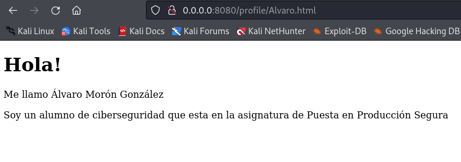

# Actividad 5 - Unidad 0 | Uso de Git (III)
----

[Creación del repositorio](#Creación-del-repositorio)

[Viendo los remotos](#Viendo-los-remotos)

[Visualizando la página web](#Visualizando-la-página-web)

[Colaborando](#Colaborando)

[Git logs](#Erre-que-erre-con-Git-Logs)

---

Vamos a realizar la creación un repositorio (con nombre **PPS-Unidad0Actividad5-Alvaro**) en la [plataforma de GitHub](https://github.com/) que contenga un proyecto php por el cual podemos visualizar una foto y descripción de los diferentes usuarios, junto con los archivos de documentación de todo el proceso realizado (en formato .md) y el resto de archivos necesarios, imágenes, etc...

### Creación del repositorio

En esta ocasión vamos a crear nuestro proyecto a partir de otro proyecto ya existente.

Lo primero es clonar el repositorio, el último parámetro "***PPS-Unidad0Actividad5-Alvaro***" es para que me cree una carpeta con ese nombre y me lo clone dentro:

Despues creamos un repositorio remoto en Github y copiamos el enlace para subir los archivos de repositorio local por ssh:

Una vez hecho esto, eliminamos el origen remoto y añadimos el nuevo para que apunte al nuevo repositorio recién creado, después ya podemos hacer un push:

### Viendo los remotos

> Con ``git remote -v`` podemos ver los repositorios remotos asociados al repositorio local que tenemos configurados:

### Visualizando la página web

1. Visualizo con php el contenido de la página web( ``php -S 0:8080``):

3. Introduzco dentro de la carpeta img una imagen de mi avatar reemplazando la que estaba:

5. Dentro de la carpeta profile creo un archivo html con el mismo nombre del archivo de la imagen que copiamos en el punto anterior, reemplazando el que estaba:

7. Lanzo el comando php para que se muestre el contenido de la página web y ver cómo se ha modificado:

### Colaborando

> Vamos a añadir a dos colaboradores en nuestro proyecto desde la ___Configuración___ del Repositorio, apartado ___Collaborators___. Éstos podrán realizar cambios en él. 

De la misma forma dos compañeros nos habrán invitado como colaboradores en sus repositorios, cunado nos llegue la invitación la aceptamos y ya podremos hacer cambios en el.

1. Aceptamos la invitación de colaboración en su repositorio y clonamos el repositorio (Hay que que crear una carpeta nueva para él):

2. Añado una nueva rama con mi nombre(``git branch``):

3. Cambiamos a la rama que he creado(``git checkout``):

4. Comprobamos en que rama nos encontramos (``git status`` nos dá la información):

5. Miramos los remotos que tenemos configurados:

6. Añadimos en esa rama mis archivos de usuario (avatar y profile):

7. Subo los cambios de mi rama al repositorio remoto y compruebo que puedo verlos en la web:

> Ahora vamos a hacer modificaciones en la rama main de mis compañeros. Es importante que el tiempo entre el push y el pull sea pequeño, ya que si en ese tiempo hay modificaciones por parte de otro colaborador, es posible que haya inconsistencias, en cuyo caso tendremos que utilizar ``git merge``.

1. Me cambio a la rama main de los proyectos de mis compañeros:

2. Añado en ella mis archivos de usuario (avatar y profile):

3. Subo los cambios a la rama main de los repositorios de mis compañeros:

4. Vuelvo a mi repositorio y compruebo en qué rama me encuentro:

### Erre que erre con Git Logs

>Repasemos git logs

1. Muestra los logs:

3. Muestra los logs de los últimos 3 commits:

5. Muestra los logs utilizando el modificador ``--pretty``:

7. Muestra los logs de los últimos 2 commits donde se vean las diferencias de cada una de las entradas:

9. Muestra los logs de las modificaciones realizadas en el último día:

